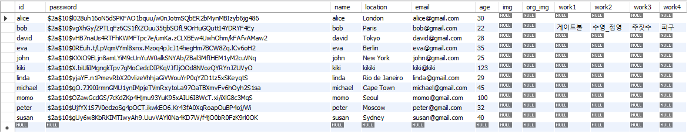

# SSAFY 1학기 최종 프로젝트 호박조

### ***운동은 재밌어야합니다.***
###### FFIT과 함께하면 다양한 운동을 경험하며 나에게 맞는 운동을 찾을 수 있어 운동이 즐거워집니다.
###### 퍼스널 컬러, 각자의 체형에 맞는 옷이 존재하듯 여러분에게 맞는 운동을 찾아보세요.
###### 얼마나 다양한 운동이 있는지 알게되면 놀라울거예요.
###### 당신의 운동 여정, 지금 시작해볼까요?     

## 첫화면

{: width="600" height="400"}

## 핵심 서비스 - 자기에게 맞는 운동 찾기! 

### 설문조사 -> 설문조사 결과에 따라 알맞은 운동을 추천해드립니다.

{: width="700" height="1000"}

### 직접 선택 -> 맘에 드는 운동을 직접 선택할 수 있습니다.

{: width="700" height="1000"}

### 운동 영상 추천 -> 딱 맞는 운동 영상을 추천해드립니다.

{: width="800" height="600"}
 
## 프론트 vue 프로젝트 구조
----------------------------------------------------------------------
├─ .env  
├─ .gitignore  
├─ index.html  
├─ package-lock.json  
├─ package.json  
├─ public  
│  └─ favicon.ico  
├─ README.md  
├─ src  
│  ├─ App.vue  
│  ├─ assets  
│  │  ├─ logo.png  
│  │  ├─ main_bg.jpg  
│  │  └─ nocturne.mp3  
│  ├─ components  
│  │  └─ common  
│  │     ├─ LoginForm.vue  
│  │     ├─ RegistForm.vue  
│  │     ├─ Sidebar.vue  
│  │     └─ TheHeaderNav.vue  
│  ├─ main.js  
│  ├─ router  
│  │  └─ index.js  
│  ├─ stores  
│  │  ├─ counter.js  
│  │  ├─ SportsStore.js  
│  │  ├─ UserStore.js  
│  │  └─ VideoStore.js  
│  ├─ utils  
│  │  ├─ authUtil.js  
│  │  ├─ kakaoUtil.js  
│  │  ├─ sportsUtil.js  
│  │  ├─ userUtil.js  
│  │  └─ videoUtil.js  
│  └─ views  
│     ├─ AboutView.vue  
│     ├─ HomeView.vue  
│     ├─ LogoutView.vue  
│     ├─ RecommendView.vue  
│     ├─ SelectView.vue  
│     └─ VideoView.vue  
└─ vite.config.js  
-------------------------------------------------------------------------------

## ERD
{: width="1000" height="500"}

## 백엔드 클래스 다이어그램
{: width="1000" height="500"}

## 백 API
{: width="1000" height="500"}

# 특장점

## **spring-security + JWT 적용**

### DB 암호화 적용 -> 관리자도 비밀번호를 알 수 없습니다.
{: width="1000" height="800"}

### 토큰 활용 인증/인가 관리 -> 네비게이션가드 + spring-security + JWT

{: width="1000" height="800"}

{: width="1000" height="800"}

